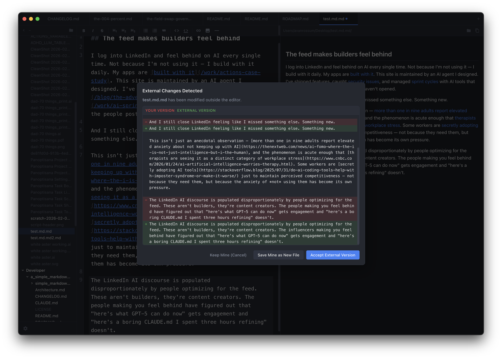

# Simple Markdown Editor

A dead simple markdown editor for macOS. Fast, focused, and free of bloat.

I live in markdown daily. Every editor I tried was either too expensive, too slow, too feature-rich, or too buggy. So I built the one I actually wanted to use — three panes, no cloud, no account, no subscription. Just a clean editor, a live preview, and a file browser that stays out of your way.

[](https://github.com/avanrossum/a_simple_markdown_editor/releases/latest)
[](LICENSE)
[](https://mipyip.com/products/simple-markdown-editor)

[Product Page](https://mipyip.com/products/simple-markdown-editor) · [Blog Post](https://mipyip.com/blog/simple-markdown-editor)

## Download

Grab the latest `.dmg` from [GitHub Releases](https://github.com/avanrossum/a_simple_markdown_editor/releases/latest). Open it, drag to Applications, done.

Signed and notarized with Apple — no Gatekeeper warnings. macOS 12+ required. Intel and Apple Silicon supported.

## Screenshots

**Three-pane layout** — file browser, editor, live preview with bidirectional scroll sync:


**External change detection** — edit a file elsewhere, get a full diff view with resolution options:



**Settings** — theme, accent color, fonts, font size, line numbers:


## What It Does

**Editor** — CodeMirror 6 with markdown syntax highlighting. Formatting toolbar with smart toggle detection (buttons detect if formatting is already applied and toggle it off). Heading buttons cycle through levels. List buttons handle multi-line selections and continue numbering. Search and replace with case sensitivity toggle, match count, and navigation.

**Live Preview** — GitHub Flavored Markdown rendered in real time. Bidirectional scroll sync keeps the editor and preview aligned (section-based anchor mapping). Local and remote images display inline. Relative image paths resolve correctly.

**File Browser** — Expandable directory tree with auto-refresh on file system changes (including subdirectories). Double-click directories to set as root. Path navigation with back button. Right-click context menu: new markdown file, new folder, rename, delete (moves to trash), show in Finder. Only markdown files are clickable.

**Tabs** — Multiple open files with dirty indicators (unsaved dot), close buttons, new tab button. Switch between files without losing your place.

**Session Restore** — Open tabs, active tab, folder path, and window size/position all persist across app restarts. Close the app, open it tomorrow — everything's exactly where you left it. Multi-window support (Cmd+Shift+N), each window preserves its own state.

**External Change Detection** — Edit a file in another app while it's open here, and you get a diff view showing what changed. Options: keep your version, accept external changes, or save as a new file. No silent overwrites.

**Customization** — Dark, light, or system-following themes. 7 accent colors. Configurable editor font (SF Mono, Menlo, Monaco, Courier New, Andale Mono) and preview font (Helvetica Neue, Georgia, Palatino, Avenir Next, Charter). Font size control. Line number toggling.

**File Associations** — Registers as a handler for `.md`, `.markdown`, `.mdown`, `.mkd`, `.mkdn`, `.mdwn`, `.mdx`, `.txt`. Shows up in Finder's "Open With" menu.

**Auto-Updates** — Checks for new versions automatically (every 4 hours). Downloads in the background. One-click "Restart & Install" with release notes. "What's New" dialog after update.

## What It Doesn't Do

No cloud sync. No collaboration. No plugin system. No Vim mode. No WYSIWYG. No proprietary format. No account creation. No subscription. No telemetry.

Your files are plain markdown on disk. Open them with anything, anywhere, forever.

## Security

This app underwent an adversarial security review with comprehensive hardening:

- **XSS prevention** — DOMPurify sanitizes all markdown before rendering in the preview pane
- **Sandbox enabled** — Chromium sandbox and context isolation enforced on all windows
- **Filesystem access control** — Path validation limits access to home directory and /Volumes; sensitive directories (.ssh, .gnupg, .aws) blocked
- **Path traversal protection** — `local-resource://` protocol restricted to image file extensions
- **URL scheme allowlisting** — `shell.openExternal` limited to https://, http://, mailto:
- **Content Security Policy** — Tightened CSP on settings and update dialogs
- **No network calls** — except auto-update checks to GitHub Releases

## Getting Started

### From release

Download the `.dmg` from [Releases](https://github.com/avanrossum/a_simple_markdown_editor/releases/latest), open it, drag to Applications.

### From source

```bash
cd simple_markdown_editor
npm install
npm run dev
```

| Command | Description |
|---------|-------------|
| `npm run dev` | Development mode with hot reload |
| `npm run build` | Production build |
| `npm run release` | Signed build + GitHub release |

Release builds require Apple Developer ID credentials (APPLE_ID, APPLE_APP_SPECIFIC_PASSWORD, APPLE_TEAM_ID) for code signing and notarization.

## Tech Stack

| Layer | Technology |
|-------|------------|
| Framework | Electron 33 |
| UI | React 18 |
| Editor | CodeMirror 6 |
| Markdown | marked (GitHub Flavored Markdown) |
| Build | Vite 6 + electron-builder |
| Security | DOMPurify, sandbox, CSP |
| File Watching | chokidar |
| Diffing | diff (external change resolution) |
| Updates | electron-updater (GitHub Releases) |
| Language | JavaScript |

## Repository Structure

The application source lives in `simple_markdown_editor/`. The outer repository holds project-level files (README, license, changelog, roadmap).

```
.
├── README.md
├── LICENSE
├── CHANGELOG.md
├── ROADMAP.md
├── Architecture.md
└── simple_markdown_editor/
    ├── package.json
    ├── vite.config.js
    ├── electron-builder.config.js
    ├── build/              # App icon and entitlements
    ├── scripts/            # Icon generation and release scripts
    └── src/
        ├── main/           # Electron main process (window lifecycle, IPC, file I/O)
        ├── renderer/       # React UI (editor, preview, file browser, tabs, toolbar)
        ├── settings/       # Settings overlay
        └── update-dialog/  # Auto-update UI
```

## Contributing

This is a personal project built for my own use, but contributions are welcome. Open an issue first if you're planning something big.

## License

[MIT](LICENSE) — made by [MipYip](https://mipyip.com)
